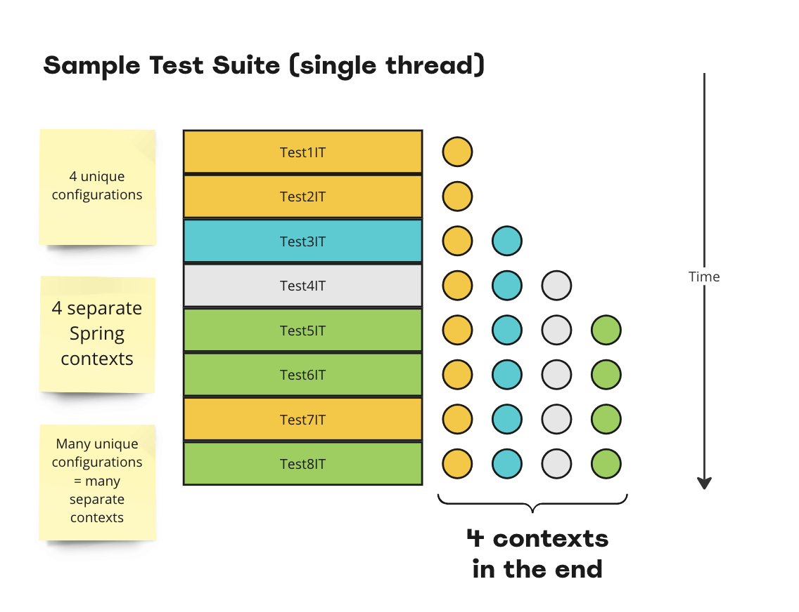
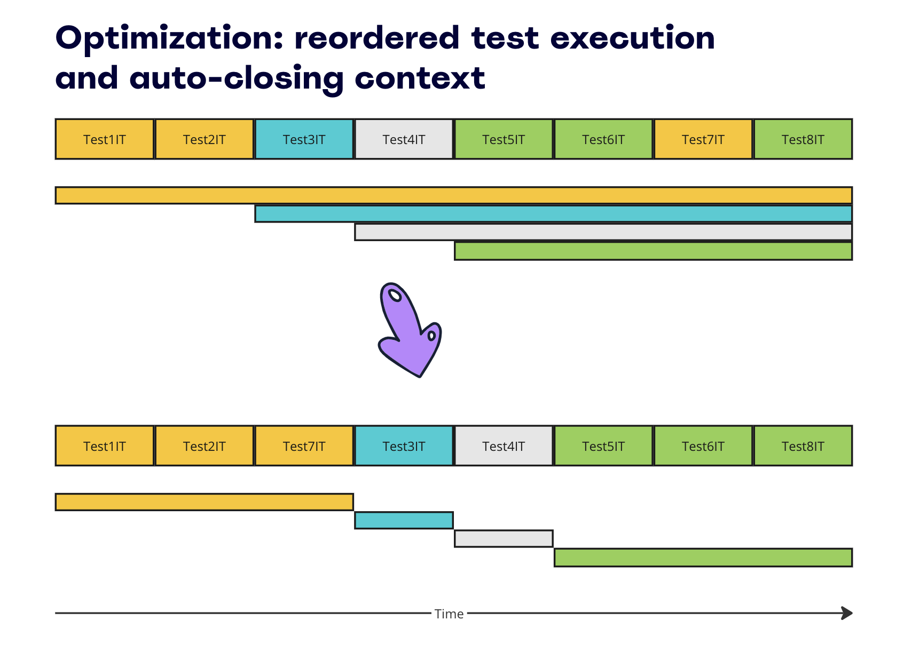
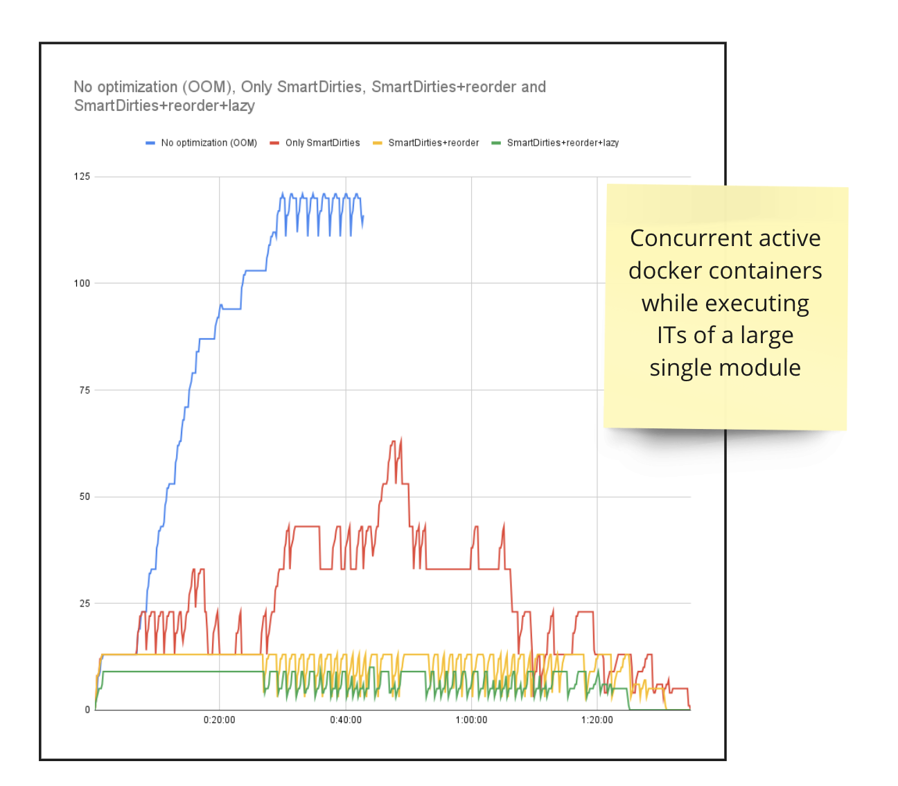

## Improving Spring Boot Test efficiency

### Problem statement
Spring test framework creates an application context according to test class configuration.
The context is cached and reused for all subsequent tests. If there is an existing context
with the same configuration, it will be reused. Otherwise, the new context will be created.
This is a very efficient and flexible approach, but it has a drawback: eventually this may
lead to out of memory errors if the number of unique configurations is too high and context
has a lot of heavyweight beans like TestContainers. In many cases simple static bean 
definition can help, but this project suggests another approach: reordering test classes
and eager context cleanup.

Consider a sample test suite of 8 classes that use 4 different configurations, classes that have the same configuration
are marked with the same colour:


In a large test suites as well as in shared CI/CD environments with lots of test pipelines
working simultaneously this may eventually lead to out of memory errors
in Java process or Docker host.

### Proposed solution
It's recommended to use statically-defined TestContainers beans, optimize reusing same configuration between tests 
e.g. via common test super-classes.
But additionally this library makes two optimizations:
* test class execution is reordered to group tests with the same context configuration so they
can be executed sequentially
* the order of tests is known, so if current test class is last per current configuration, the spring context
will be automatically closed (it's called `Smart DirtiesContext`) and the beans will be disposed releasing resources

As a result, in a suite of single module there will always be not more than 1 active spring contexts:



This chart is done via calculating the number of active docker containers while executing a suite of 120 integration
test classes that actively uses TestContainers for databases (several datasources simultaneously) and other services:



As shown on the chart, the suite just fails with OOM without the optimization.
As an advantage, the total test execution time will also become less, because resource consumption (especially memory)
will be reduced, hence tests are executed faster.

### Limitations
At the moment only single thread test execution per module is supported. Parallel test execution is work in progress.
Also there can be problems with Jupiter
[Nested](https://junit.org/junit5/docs/current/user-guide/#writing-tests-nested) test classes.

### Supported versions
`Java` 8+ (`Java` 17+ for spring-boot 3.x projects)

`Spring Boot` 2.4+, 3.x as well as bare Spring framework

Supported test frameworks:
* `JUnit 4` (via JUnit 5 [junit-vintage-engine](https://junit.org/junit5/docs/current/user-guide/#migrating-from-junit4-running))
* `JUnit 5 Jupiter`
* `TestNG` 7.0.0+ (both bare TestNG and JUnit platform [testng-engine](https://github.com/junit-team/testng-engine))

`Gradle Enterprise Maven Extension` (test execution caching) correctly supports changed behaviour

### How to use
Add maven dependency (available in maven central):
```xml
<dependency>
    <groupId>com.github.seregamorph</groupId>
    <artifactId>spring-test-smart-context</artifactId>
    <version>0.2</version>
    <scope>test</scope>
</dependency>
```
Or Gradle dependency:
```groovy
testImplementation("com.github.seregamorph:spring-test-smart-context:0.2")
```
It's recommended to check [Demo projects](demo).

### How it works

<details>
  <summary>JUnit 5 Jupiter</summary>

For projects with JUnit Jupiter it will automatically setup
[SmartDirtiesClassOrderer](spring-test-smart-context/src/main/java/com/github/seregamorph/testsmartcontext/jupiter/SmartDirtiesClassOrderer.java)
which will reorder test classes and prepare the list of last test class per context configuration.
Then this test execution listener
[SmartDirtiesContextTestExecutionListener](spring-test-smart-context/src/main/java/com/github/seregamorph/testsmartcontext/SmartDirtiesContextTestExecutionListener.java)
will be auto-discovered via [spring.factories](spring-test-smart-context/src/main/resources/META-INF/spring.factories).
Alternatively it can be defined explicitly
```java
@TestExecutionListeners(SmartDirtiesContextTestExecutionListener.class)
```
or even inherited from
[AbstractJUnitSpringIntegrationTest](spring-test-smart-context/src/main/java/com/github/seregamorph/testsmartcontext/jupiter/AbstractJUnitSpringIntegrationTest.java)
</details>

<details>
  <summary>TestNG</summary>

For projects with TestNG tests this will automatically setup
[SmartDirtiesSuiteListener](spring-test-smart-context/src/main/java/com/github/seregamorph/testsmartcontext/testng/SmartDirtiesSuiteListener.java)
which will reorder test classes and prepare the list of last test class per context configuration.
The integration test classes should add
[SmartDirtiesContextTestExecutionListener](spring-test-smart-context/src/main/java/com/github/seregamorph/testsmartcontext/SmartDirtiesContextTestExecutionListener.java)
```java
@TestExecutionListeners(SmartDirtiesContextTestExecutionListener.class)
```
Note: the annotation is inherited, so it makes sense to annotate the base test class or use
[AbstractTestNGSpringIntegrationTest](spring-test-smart-context/src/main/java/com/github/seregamorph/testsmartcontext/testng/AbstractTestNGSpringIntegrationTest.java)
parent.
</details>

<details>
  <summary>JUnit 4</summary>

The JUnit 4 does not provide standard way to reorder test class execution, but it's still possible via
[junit-vintage-engine](https://junit.org/junit5/docs/current/user-guide/#migrating-from-junit4-running).
This dependency should be added to test scope of the module:
```xml
<dependency>
    <groupId>org.junit.vintage</groupId>
    <artifactId>junit-vintage-engine</artifactId>
    <scope>test</scope>
</dependency>
```
or for Gradle (see [detailed instruction](https://docs.gradle.org/current/userguide/java_testing.html#executing_legacy_tests_with_junit_vintage)):
```groovy
testRuntimeOnly('org.junit.vintage:junit-vintage-engine')
testRuntimeOnly('org.junit.platform:junit-platform-launcher')
```
Also the `surefire`/`failsafe` plugins should be configured to use junit-platform:
```xml
<plugin>
    <groupId>org.apache.maven.plugins</groupId>
    <artifactId>maven-surefire-plugin</artifactId>
    <version>${maven-surefire.version}</version>
    <dependencies>
        <dependency>
            <groupId>org.apache.maven.surefire</groupId>
            <artifactId>surefire-junit-platform</artifactId>
            <version>${maven-surefire.version}</version>
        </dependency>
    </dependencies>
</plugin>
<plugin>
    <groupId>org.apache.maven.plugins</groupId>
    <artifactId>maven-failsafe-plugin</artifactId>
    <version>${maven-surefire.version}</version>
    <dependencies>
        <dependency>
            <groupId>org.apache.maven.surefire</groupId>
            <artifactId>surefire-junit-platform</artifactId>
            <version>${maven-surefire.version}</version>
        </dependency>
    </dependencies>
</plugin>
```
or for Gradle:
```groovy
tasks.named('test', Test) {
    useJUnitPlatform()
}
```

For projects with JUnit 4 it will automatically setup
[SmartDirtiesPostDiscoveryFilter](spring-test-smart-context/src/main/java/com/github/seregamorph/testsmartcontext/SmartDirtiesPostDiscoveryFilter.java)
which will reorder test classes on the level of junit-launcher and prepare the list of last test class per context configuration.
Then this test execution listener
[SmartDirtiesContextTestExecutionListener](spring-test-smart-context/src/main/java/com/github/seregamorph/testsmartcontext/SmartDirtiesContextTestExecutionListener.java)
will be auto-discovered via [spring.factories](spring-test-smart-context/src/main/resources/META-INF/spring.factories).
Alternatively it can be defined explicitly
```java
@TestExecutionListeners(SmartDirtiesContextTestExecutionListener.class)
```
or even inherited from
[AbstractJUnit4SpringIntegrationTest](spring-test-smart-context/src/main/java/com/github/seregamorph/testsmartcontext/junit4/AbstractJUnit4SpringIntegrationTest.java)
</details>

### Additional materials
See the online presentation of the project https://www.youtube.com/watch?v=_Vci_5nr8R0 hosted by 
[AtomicJar](https://www.atomicjar.com/), the creators of [TestContainers](https://testcontainers.com/) framework.

### Known projects using library


[Miro](https://miro.com/) is using this approach to optimize huge integration test suites and it saved a lot of resource
for CI/CD pipelines.
